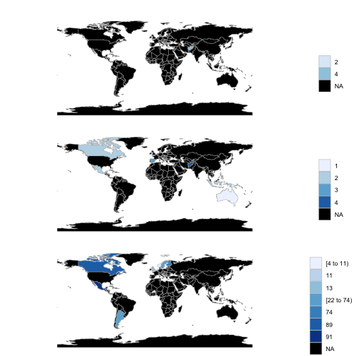

phylodiv
========


[](https://travis-ci.com/ropensci/phylodiv)
[](https://ci.appveyor.com/project/sckott/phylodiv-175/branch/master)
[](https://codecov.io/github/ropensci/phylodiv?branch=master)
[](https://github.com/metacran/cranlogs.app)
[](https://cran.r-project.org/package=phylodiv)


`phylodiv`: Phylogenetic Biodiversity Query Tools


## Installation

Development version from GitHub


```r
if (!require("remotes")) install.packages("remotes")
remotes::install_github("ropensci/phylodiv")
```


```r
source("https://bioconductor.org/biocLite.R")
biocLite("ggtree")
```


```r
library('phylodiv')
```

## The idea

```
# given a tree
tree
# read the tree
pd_read()
# collect all higher taxonomic information from those names
pd_taxa()
# compose a phylogeny based query
pd_query()
# send the query to a biodiversity backend, e.g., GBIF
pd_biodiv()
# visualize results
pd_viz()
```

## given a tree


```r
library(ape)
heli <- c("Helianthus agrestis", "Helianthus angustifolius", "Helianthus annuus", 
  "Helianthus deserticola", "Helianthus divaricatus", "Helianthus eggertii", 
  "Helianthus gracilentus", "Helianthus hirsutus", "Helianthus inexpectatus", 
  "Helianthus laciniatus", "Helianthus maximiliani",
  "Helianthus nuttallii", "Helianthus occidentalis", "Helianthus paradoxus", 
  "Helianthus pauciflorus", "Helianthus petiolaris", "Helianthus porteri", 
  "Helianthus verticillatus", "Helianthus winteri")
tree <- rcoal(length(heli))
(tree$tip.label <- heli)
#>  [1] "Helianthus agrestis"      "Helianthus angustifolius"
#>  [3] "Helianthus annuus"        "Helianthus deserticola"  
#>  [5] "Helianthus divaricatus"   "Helianthus eggertii"     
#>  [7] "Helianthus gracilentus"   "Helianthus hirsutus"     
#>  [9] "Helianthus inexpectatus"  "Helianthus laciniatus"   
#> [11] "Helianthus maximiliani"   "Helianthus nuttallii"    
#> [13] "Helianthus occidentalis"  "Helianthus paradoxus"    
#> [15] "Helianthus pauciflorus"   "Helianthus petiolaris"   
#> [17] "Helianthus porteri"       "Helianthus verticillatus"
#> [19] "Helianthus winteri"
```

## read the tree


```r
(res <- pd_read(tree))
#> <PhyloDiv> 
#>   trees: 1
```

The PhyloDiv object


```r
class(res)
#> [1] "PhyloDiv" "R6"
names(res)
#>  [1] ".__enclos_env__"   "data"              "query"            
#>  [4] "trees"             "clone"             "to_json"          
#>  [7] "to_list"           "fetch_hierarchies" "add_tree"         
#> [10] "initialize"        "print"
```

## collect all higher taxonomic information from those names


```r
(res <- pd_taxa(res))
#> <PhyloDiv> 
#>   trees: 1
res$trees
#> [[1]]
#> <PhyloDivOne> 
#>   tips: 19
#>   nodes: 18
#>   hierarchies: TRUE
```

## compose a phylogeny based query


```r
res <- pd_query(res, c("Helianthus agrestis", "Helianthus angustifolius", "Helianthus petiolaris"))
res$query
#> [1] "Helianthus agrestis"      "Helianthus angustifolius"
#> [3] "Helianthus petiolaris"
```

## send the query to a biodiversity backend, e.g., GBIF


```r
(res <- pd_biodiv(res, type = 'facet', by = "country"))
#> <PhyloDiv> 
#>   trees: 1
```

## visualize results


```r
pd_vis(res, type = "facet")
```



## metadata


```r
pd_meta() # print to cosole
pd_meta(file = (file <- tempfile())) # save to file
jsonlite::fromJSON(file)
```

## Thinking out loud

**general questions**
- how do people interact with phylogenies in R? that is how to they most often refer to nodes/tips?
- what about the use case of comparing 1 or more phylogenies against one another?
- 

**pd_read**:
- make sure to handle any local or remote tree, and many R tree objects

**pd_taxa**:
- add option to use taxizedb to handle large data problems better
- is there a way to programatically label upstream nodes after collecting taxonomic hierarchies?

**pd_query**:
- this is the most slippery problem
- two major approaches: taxonomic or phylogenetic 
    - taxonomic e.g., if user wants specific names (e.g., i want species A, B, and C)
    - phylogenetic e.g., if user wants to see clade A compared to clade B
- what to do if a user wants higher node in the tree for which we don't know the name?
    - are there tools to guess these names?
    - possibly just error with message telling user to name that node?

**pd_biodiv** options include (assuming using GBIF):
- get all occurrences (via `rgbif::occ_data()`), slowish; need caching mechanism
- get just count data (via `rgbif::occ_data()`, but just get counts), fast; probably no need for caching mechanism
- GBIF downloads (via `rgbif::occ_download()`), slowish, but only option to "get all the data"; need caching mechanism

**pd_vis** options include:
- base plots, plain ol maps
- GBIF maps API, rasters:
    - with base plots, static maps
    - with leaflet, interactive maps
- do we support maps of occurences matched against a phylogeny? or is that not needed?
- perhaps other R packages can be leveraged here

## Meta

* Please [report any issues or bugs](https://github.com/ropensci/phylodiv/issues).
* License: MIT
* Get citation information for `phylodiv` in R doing `citation(package = 'phylodiv')`
* Please note that this project is released with a [Contributor Code of Conduct](CODE_OF_CONDUCT.md).
By participating in this project you agree to abide by its terms.

[](https://ropensci.org)
